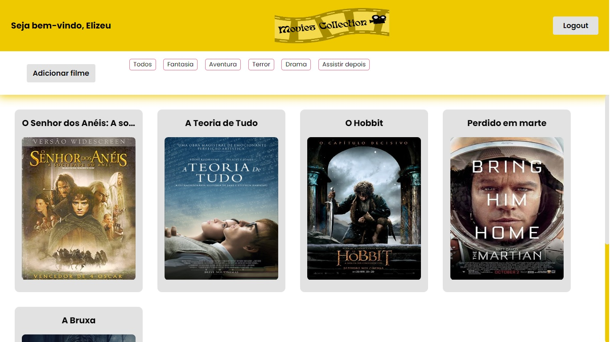
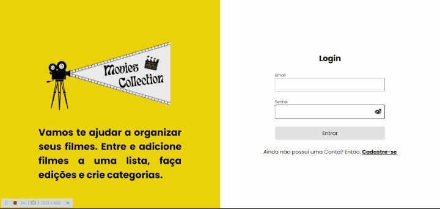

<h1>💻 MOVIES COLLECTION</h1>

<div style="display:flex; justify-content:center">

</div>

<br>

<p style="text-align:justify">O Movies Collection é uma aplicação para quem precisa organizar seu histórico de filmes. Para utilizar o site é preciso se cadastar, o processo é bem rápido. Na aplicação é possível criar, editar e excluir um filme. Todos os filmes criados são automaticamente listados na dashboard e o usuário ainda pode filtrar os filmes de acordo com a categoria que ele mesmo criou quando cadastrou um filme. A Aplicação é Full Stack, com front-end desenvolvido em React e back-end em Node.</p><br>

<h1>🔗 LINKS</h1>

<a href="https://project-movie-collection-frontend.vercel.app/" target="_blank">SITE DA MOVIE COLLECTION</a>

<a href="https://github.com/elizeu-vasconcelos1992/project-movie-collection-frontend" target="_blank">REPOSITÓRIO DA MOVIE COLLECTION</a>

<a href="https://movies-collection-test.herokuapp.com/" target="_blank">DEPLOY DO BACK-END DA MOVIE COLLECTION</a>

<a href="https://github.com/elizeu-vasconcelos1992/project-movie-collection-backend" target="_blank">REPOSITÓRIO DO BACK-END DA MOVIE COLLECTION</a>

<br>

<h1>🔗 ACESSO</h1>

<p>Crie seu próprio perfil no site ou entre com um usuário-teste, com alguns filmes cadastrados.</p>

```
email: elizeu@gmail.com
senha: 1234
```

<br>

<h1>🔨 RECURSOS</h1>

<h2> Página Inicial </h2>

<br>

<div style="display:flex; justify-content:center">

</div>

<br>

<p>Na página inical existem dois recursos: login e cadastro. Caso o usuário não tenha cadastro, será necessário fazê-lo para acessar a aplicação. No cadastro são solicitados o name, email e senha e para efetuar o login, deve-se utilizar o email e senha cadastrados. Ambos recursos contam com regras de négocio implementadas via front e back-end, tanto no caso de requisição aceita ou rejeitada são apresentados modais de sucesso e erro para que o usuário possa seguir ou corrigí-los. Se o login for bem-sucedido, o usuário é encaminhado para dashboard. Caso seja o primeiro acesso, nenhum filme ou categoria são listados até que o primeiro filme seja adicionado.</p>

<br>

<h2> Dashboard </h2>

<br>

<div style="display:flex; justify-content:center">

</div>

<br>

<p>Na header da dashboard é listado o nome do usuário e existe o botão de logout, para que o usuário possa sair da aplicação. Na main, estão presentes as opções de adicionar um filme, lista das categorias cadastradas e a lista de filmes em cards do tipo flip, em que, na parte frontal são listados o nome e a imagem do filme cadastrado e na parte traseira estão presentes o nome, data de lançamento, categoria, sinopse e o botão de editar. A seguir esses recursos são mais detalhados. </p>

<br>

<h2> Adicionar filme </h2>

<br>

<div style="display:flex; justify-content:center">

</div>

<br>

<p>Ao clicar em "Adicionar filme" será apresentado um modal do tipo formulário para que o usuário possa inserir das informações solicitadas. As entradas são: nome, url da image, data de lançamento, sinopse e categoria. Todas as entradas são obrigatórias, o formulário conta com validações via biblioteca yup e o back-end também valida os dados. O resultado da adição, ou não, do filme é confirmada via modais de sucesso ou erro. Em caso positivo, o novo filme cadastrado é listado na dashboard. </p>

<br>

<h2> Editar filme </h2>

<br>

<div style="display:flex; justify-content:center">

</div>

<br>

<p>Para editar um filme, basta passar o mouse sobre o card desejado e, na parte traseira, clicar em "Editar filme". Um modal do tipo formulário vai surgir e o usuário pode editar o campo de desejar, nenhum campo é obrigatório. As informações editáveis são: nome, url da imagem, data de lançamento e sinopse. No mesmo formuláro existe a opção de deletar o filme, caso seja clicado, o filme será deletado da lista. O formulário de edicação e exclusão de filme conta com validações via biblioteca yup e o back-end também valida os dados. Os resultados das ações de edição e/ou exclusão de um filme são confirmados através de modais de sucesso e/ou erro.</p>

<br>

<h2> Filtrar filmes por categoria </h2>

<br>

<div style="display:flex; justify-content:center">

</div>

<br>

<p>Ao adicionar um filme o usuário pode criar um nova categoria para ele ou pode adicioná-lo em uma que ele havia criado antes, agrupando os filmes de acordo com sua vontade. Para filtrar os filmes por categoria, basta clicar nas tags listadas ao lado do botão de adicionar filme. Se uma categoria ficar sem filme, nada é listado na tela até que o usuário a vincule a um novo filme, quando este for adicionado.</p>

<br>

<h2> Logout </h2>

<br>

<div style="display:flex; justify-content:center">

</div>

<br>

<p>O usuário pode sair da aplicação ao clicar em "Logout", sendo redirecionado para a página inicial. Se o usuário fizer lougout, somente conseguirá acessar a dashboard se fizer novamente o login.</p>

<br>

<h2> Resumo dos recursos </h2>

<br>

<ul>
<li><strong>Cadastro:</strong> para utilizar a aplicação é necessário realizar cadastro.</li>
<li><strong>Login:</strong> o usuário cadastrado pode realizar login.</li>
<li><strong>Logout:</strong> o usuário cadastrado pode sair da aplicação.</li>
<li><strong>Perfil:</strong> o nome do usuário é listado no header da dashboard.</li>
<li><strong>Cadastro de filmes:</strong> o usuário pode cadastrar novos filmes.</li>
<li><strong>Lista de filmes:</strong> o usuário verá uma lista contendo seus filmes cadastrados.</li>
<li><strong>Lista de filmes por categoria:</strong> o usuário pode filtrar seus filmes de acordo com as categorias por ele criadas.</li>
<li><strong>Edição de filmes:</strong> o usuário pode editar uma ou mais características dos seus filmes.</li>
<li><strong>Deletar filmes:</strong> o usuário pode deletar seus filmes.</li>
<li><strong>Alertas:</strong> o usuário é informado, através de modais, se as suas requisições tiveram ou não sucesso.</li>
</ul><br>

<br>

<h1>🚀 TECNOLOGIAS</h1>

<br>

<h2> Front-end </h2>

<ul>
<li>TYPESCRIPT</li>
<li>REACT</li>
<li>CONTEXT-API</li>
<li>REACT-ROUTER-DOM</li>
<li>CONSUMO DE API REST</li>
<li>AXIOS</li>
<li>REACT-HOOK-FORM</li>
<li>YUP VALIDATION</li>
<li>FRAME-MOTION</li>
<li>STYLED-COMPONENTS</li>
<li>DEPLOY VERCEL</li>
</ul>

<br>

<br>

<h2> Back-end </h2>

<li>TYPESCRIPT</li>
<li>NODE</li>
<li>EXPRESS</li>
<li>TYPE-ORM</li>
<li>POSTGRESQL</li>
<li>BCRYPT</li>
<li>JSONWEBTOKEN</li>
<li>CORS</li>
<li>CLASS-TRANSFORMER</li>
<li>DEPLOY HEROKU</li>
</ul>

<br>
